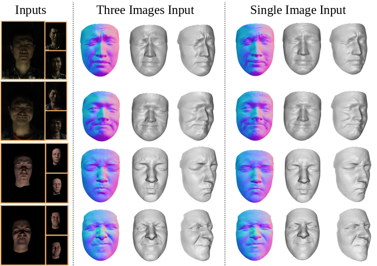

# FacePSNet
This repository includes the source code and trained model of paper "Lightweight Photometric Stereo for Facial Details Recovery", CVPR 2020, [https://arxiv.org/abs/2003.12307](https://arxiv.org/abs/2003.12307).

Authors: Xueying Wang, Yudong Guo, [Bailin Deng](http://www.bdeng.me/) and [Juyong Zhang](http://staff.ustc.edu.cn/~juyong/).

Note that all of the code is protected under patent. It can be only used for research purposes. If you are interested in business purposes/for-profit use, please contact Juyong Zhang (the corresponding author, email: juyong@ustc.edu.cn).

## Results
 
Sample results with different inputs. From left to right: input images, estimated normal maps and reconstructed 3D face 
models. Here we use the leftmost image as the single input. You can find more results in the paper and supplementary material.


## Requirements
#### 1. Basic Environment
- Ubuntu, CUDA-10.1, Python 3.7
- C++ libraries: OpenCV, Eigen
- Python packages: PyTorch(=1.3.1), Numpy, OpenCV, gen_normal_mask

#### 2. Install
To install the third-party package 'gen_normal_mask' you need to do the following step:
 ```bash
 cd gen_normal_mask -> run 'python set_up.py install'
``` 


## Usage
### Testing
#### 1. Trained Models
Our trained models are contained as
 ```bash
 trained_models/proxy.pth       # Proxy Estimation Network
 trained_models/normal.pth.tar  # Normal Estimation Network
``` 

#### 2. Test FacePSNet on the sample subject
 ```bash
 # Prepare the input images in sample/**.jpg
 # Test FacePSNet on the sample subject with three images as input
 bash test_sample.sh
 # Please check the outputs in output/
``` 

#### 3. Test FacePSNet on your own subject
First you need to create a new path to store arbitrary number of images as input for a sinlge subject. 
Here we use three images in 'sample/' as input for the sample subject. You can change the number of input images according to your situation. 
Then you need to create a new list to store the path of all input images for a single subject, like 'sample_imgs.txt'. 
After preparing your input images you can call the following command:
 ```bash
 # Test FacePSNet on your own images with arbitrary number of images as input
 # The sample command is in our 'test_sample.sh'
 python main.py [gpu_id] [list] [output_path]
 # Please check the outputs in your output path
``` 

### Vertex Recovery
#### 1. Compile
Before using this code to recover the face model, you need to do the following two things in ShapefromNormal/:
- Compile process_normal.cpp 
 ```bash
 g++ -O2 -std=c++11 process_normal.cpp -o process_normal `pkg-config --cflags --libs opencv`
``` 
- Compile view_depth.cpp
 ```bash
 g++ -O2 -std=c++11 view_depth.cpp -o view_depth `pkg-config --cflags --libs opencv`
``` 

#### 2. On the sample subjet
Given a normal map and proxy parameters estimated from our network, a hight quality 3D face model can be reconstructed using the following command:
 ```bash
 # Reconsturct 3D face model of our sample subject
 cd ShapefromNormal 
 bash run.sh
 # Please check the 'depth.obj' in output/
``` 

#### 3. On your own subjects
You need to create a new list to store the path of the normal map and proxy parameters for a single subject, like 'ShapefromNormal/list.txt'. 
You can contain more subject's paths at the same time.
After preparing your list you can call the following command:
 ```bash
 # Reconsturct 3D face model of your own subjects
 # You need to adjust 'run.sh' according to your specific situation
 cd ShapefromNormal
 bash run.sh
```
Then you can check the outputs in your listed paths. 


## Citation
Please cite the following papers if it helps your research: 
 ```
 @inproceedings{Wang2020Lightweight,
      title={Lightweight Photometric Stereo for Facial Details Recovery},
      author={Wang, Xueying and Guo, Yudong and Deng, Bailin and Zhang, Juyong},
      booktitle={IEEE Conference on Computer Vision and Pattern Recognition (CVPR)},
      year={2020}
}
``` 


## Acknowledgement
This work was supported by the National Natural Science Foundation of China (No. 61672481), and Youth Innovation Promotion Association CAS (No. 2018495).


